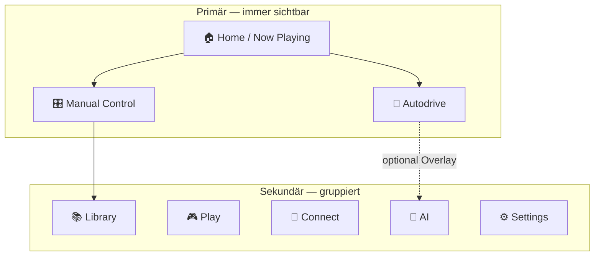
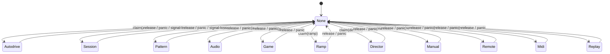
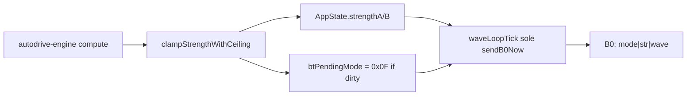
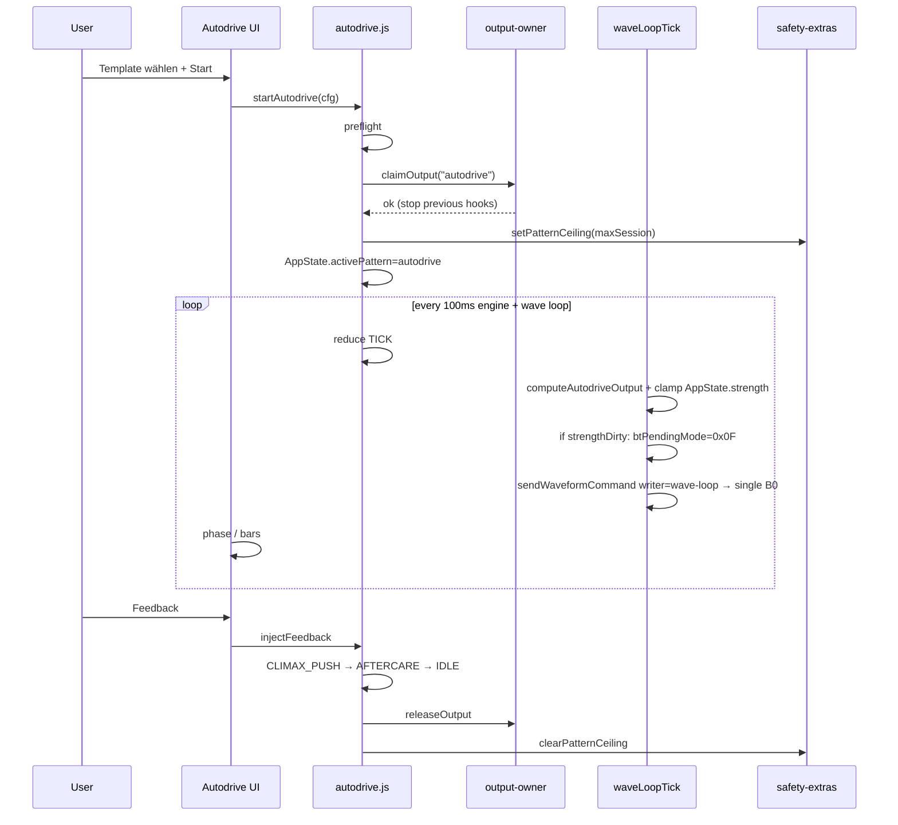
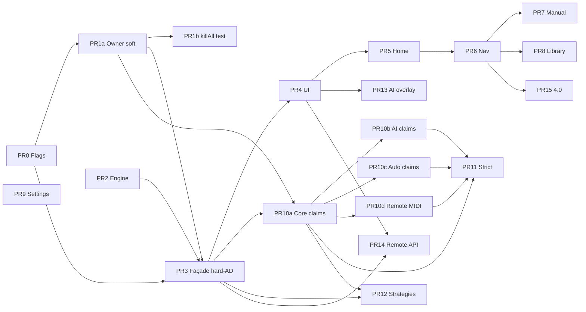

# Design Document: App-Restrukturierung + Autodrive-Modus (Stim App / CoyoteApp)

| Feld | Wert |
|------|------|
| **Titel** | Complete App Restructure + Autodrive Mode |
| **Autor** | TBD (Design) |
| **Datum** | 2026-07-25 |
| **Status** | Partially shipped through 3.14; **IA shell shipped in 4.0.0** (see `ROADMAP-4.0.md`) |
| **Zielversion** | 4.0.0 (inkrementell ab 3.9.x → 3.10… → 4.0) |
| **Repo** | `C:\opencode\CoyoteApp` (Stim App v3.9.3) |
| **Scope** | Frontend-Produktarchitektur + neuer Autodrive-Engine; **kein** Electron-Rewrite |

---

## Overview

Die Stim App steuert ein DG-LAB Coyote 3.0 per BLE V3 (`0xB0` / `0xBF` / `0xB1`). Die Feature-Fläche ist über PR1–PR6 organisch gewachsen: sieben Sidebar-Tabs, ein überfüllter Header, parallele Ausgabepfade (Patterns, Sessions, Ramp, Audio, Spiele, AI Director, MIDI, Triggers, Music-Sync) und ein zentraler Wave-Loop mit riesiger Verzweigung in `frontend/js/control-deck.js`. Der primäre Use-Case — *verbinden → Limits setzen → Session starten → zum Höhepunkt führen* — ist im UI und in der Architektur vergraben.

Dieses Dokument spezifiziert:

1. **UX-Restrukturierung** um eine session-zentrische Navigation (Home / Autodrive / Manual / Library / …).
2. **Autodrive** als offline-fähige, safety-konforme, adaptive State-Machine, die ohne LLM zuverlässig Richtung Climax/Orgasmus steuert.
3. **Technische Ownership-Schicht** (`OutputOwner`), damit nur ein Subsystem gleichzeitig Strength/Waveform steuert.
4. **Inkrementellen PR-Plan** ohne Big-Bang-Rewrite.

**Ehrliches Produktversprechen:** „Hohe Erfolgsrate durch Anpassung und Feedback“ — **nicht** medizinische Garantie, dass „jeder abspritzt“. Biologische Varianz, Soft-Limits, Consent und Gerätegrenzen bleiben hart. Messbare lokale Proxies (siehe Observability) ersetzen Marketingsprache.

---

## Background & Motivation

### Ist-Zustand (verifiziert im Code)

#### Navigation & UI-Oberfläche

Sidebar in `frontend/index.html` (Zeilen ~55–90):

| `data-tab` | Label | Inhalt (Auszug) |
|------------|-------|-----------------|
| `deck` | Control Deck | A/B-Slider, 14 Patterns, Ramp, Multi-Phase Sessions |
| `stim` | STIM Player | Audio → Stim |
| `games` | Mini-Spiele | Reflex, Rhythm, Edge, Potato, Survival |
| `editor` | Pattern Editor | v1 **und** v2 nebeneinander (`pattern-editor.js` + `pattern-editor-v2.js`) |
| `remote` | Remote | WebSocket-Server + API |
| `ai` | AI Chat | Chat + AI Director Panel |
| `settings` | Einstellungen | Soft-Limits, BF-Balance, Profile, Hotkeys, Recorder, Scheduler, MIDI, PIN, Triggers, Memory, Webcam, Story, Dice, Music-Sync, … |

Header: Safety-Chip, Battery, Presets (Sanft/Mittel/Intensiv), Safety-Timer, Hotkey-Hilfe, Master-Slider — ständig sichtbar und dicht.

Tab-Persistenz: `stim_app_last_tab` in `frontend/js/modules/tab-persistence.js`.

Hotkeys: `keyboard-bindings.js` `TAB_MAP` digits `1`–`7` → sieben Tabs. Hardcodierte `data-tab`-Selektoren u. a. in `fun.js` (`games`), `search.js`, `pattern-editor.js` (`settings`).

#### Existierende „autonome“ Bausteine (Reuse)

| Modul | Pfad | Rolle | Limitierung für „zum Climax führen“ |
|-------|------|-------|-------------------------------------|
| AI Director | `frontend/js/modules/ai-director.js` | LLM-Regisseur IDLE/RUNNING/PAUSED, Beats **konfigurierbar 10–600s** (Default 30s, `MIN_BEAT_INTERVAL_SEC`/`MAX_BEAT_INTERVAL_SEC`), Personas, maxIntensity, Auto-Stop | **Benötigt LLM** (Ollama/OpenRouter); nicht offline-zuverlässig |
| Sessions | `frontend/js/modules/sessions.js` | Open-loop Multi-Phase-Wave-Skripte mit **einmaligem Baseline-Strength** (`ensureGameStrength(40)` beim Start), danach nur Amp/Freq-Modulation | Kein adaptives Strength-Envelope, kein User-Feedback, feste Dauer |
| Ramp | `frontend/js/modules/ramp.js` | Lineare Strength A/B über Zeit (1s Ticks), Pattern-Ceiling | Keine Patterns/Phasen, kein Climax-Ziel |
| Edge Game | `frontend/js/modules/games-extra.js` | Manuelles Hold-the-Edge | Spiel, kein Session-Engine |
| Patterns | `control-deck.js` + `constants.js` | 14 UI-Patterns: gentle, rhythm, tease, climax, strobe, random, wave, heartbeat, alternate, escalate, flutter, drift, sawtooth, duet (+ intern `ai_custom`, `session`) | Manuell wählbar, kein Phasenplan |
| Safety | `safety.js`, `safety-extras.js` | Panic → `killAllOutput` + Cooldown 30s, Ceiling, Signal-Loss soft-stop | Muss von Autodrive respektiert werden |
| AI Bridge | `ai-bridge.js` | set_intensity, play_pattern, stop_all | Tool-Layer, kein Orchestrierer |

#### Output-Chaos (kein Ownership)

Viele Module rufen unabhängig `sendStrengthCommand` / `sendWaveformCommand` (`bluetooth.js`):

- `control-deck.js` (Wave-Loop, Slider)
- `ramp.js`, `sessions.js` (via Pattern `"session"`)
- `games.js` / `games-extra.js`, `audio.js`
- `ai-bridge.js`, `ai-director.js`
- `dice.js`, `music-sync.js`, `triggers.js`, `recorder.js`, `fun.js`
- `midi-controller.js` (Action `set-strength`)

`AppState` hält Dutzende Mode-Flags (`activePattern`, `isAudioPlaying`, `edgeState`, `potatoState`, `survivalState`, `rampState`, …) ohne wechselseitigen Mutex. `status-ui.js` *beschreibt* den aktiven Modus heuristisch (`activeOutputModeLabel`) und **übersieht** bereits heute Ramp, Director, Dice, Music-Sync, MIDI — nur Pattern/Audio/Games/Strength. Erzwingt keinen Mutex.

Wave-Loop (`startWaveLoop` in `control-deck.js`): eine `async function waveLoopTick` mit Prioritätskette:

```
session → activePattern (14+ Zweige) → audio → reflex shock → mini-games skip → idle constant wave
```

**Wichtig:** Bei `owner === none` und Verbindung sendet der Idle-Zweig weiterhin Carrier-Wave (amp 100) mit aktueller User-Strength — der Wave-Loop ist ein **impliziter Dauer-Writer**.

#### Safety-Hooks, die Autodrive erben muss

- Soft-Limits → `0xBF` + Clamp in `sendStrengthCommand` via `clampStrengthWithCeiling`
- Master-Scale in B0-Encoding (nicht in AppState-Strength gebacken)
- Panic: `killAllOutput` → hard-coded Stops (Ramp, Session, Audio, Games) + Emergency Stop + `stim:kill-all` CustomEvent (Director/Dice/Music-Sync lauschen)
- Panic-Cooldown 30s (`PANIC_COOLDOWN_MS`)
- Pattern-Ceiling (`AppState.patternCeiling`)
- Session-PIN (`blockIfPinLocked`)
- Signal-Loss-Watchdog: `sendSoftStop` + panic UI-Flag; **stoppt heute keine Owner-Timer** (Ramp/Session/Director laufen weiter) — Lücke, die Autodrive schließen muss

### Pain Points (bestätigt / prioritisiert)

1. **Primärpfad vergraben** — „einfach starten und fertig werden“ erfordert Navigation über Deck + Limits + Pattern/Session/Director.
2. **Feature-Sprawl** — Settings-Tab und Sidebar konkurrieren um Aufmerksamkeit; Power-Features und Core gleichwertig.
3. **Mode-Konflikte** — kein Output-Owner; Ramp + Pattern + Game können überlappen.
4. **LLM-Abhängigkeit** für „autonome“ Session — Director ist flagship, aber nicht der Default für Offline/Zuverlässigkeit.
5. **Keine adaptive Climax-Engine** — Sessions sind open-loop; Edge ist manuell.
6. **Doppelter Pattern-Editor** — Legacy v1 + v2.
7. **Wave-Loop-Monolith** — schwer testbar, schwer erweiterbar.
8. **Dual-B0-Risiko** — `sendStrengthCommand` und `sendWaveformCommand` schreiben beide vollständige B0-Pakete; zwei Timer thrashen BLE-Queue/Seq/Ack.

---

## Goals & Non-Goals

### Goals

1. **Home-first UX**: In < 3 Klicks von App-Start zu laufender Autodrive-Session (wenn bereits verbunden + Soft-Limits gesetzt). *Voll erreicht ab PR5–PR6; interim PR4: Autodrive-Tab erreichbar.*
2. **Autodrive offline-first**: Deterministische Engine ohne LLM; AI optional als Overlay.
3. **Hohe Erfolgsrate durch Adaptation**: Feedback-Buttons + Profil-Templates + Soft-Limit-relative Intensität — gemessen an lokalen Proxies (siehe Observability).
4. **Safety-Parität**: Panic, Soft-Limits, Ceiling, Cooldown, PIN, Disconnect, Signal-Loss — keine Regression.
5. **Output Ownership**: Genau ein Session-Owner steuert Strength+Wave; klare Claim/Release-API; System-Writer (wave-loop/safety) definiert.
6. **Testbare Kernlogik**: Phasen-Transitionen, Envelope, Feedback-Adaptation als pure Funktionen (analog `ramp.js` / `protocol-utils.js`).
7. **Inkrementelle Migration**: PR-weise mergebar; localStorage-Keys migrieren; bestehende Features erreichbar halten (Aliases/Flags).

### Non-Goals

- Kein Electron-Main/Preload-Rewrite.
- Kein TypeScript.
- Keine medizinische/klinische Claim-Sprache in UI/Marketing-Copy.
- Keine Webcam/HR-Pflicht für v1 Autodrive (optional später, privacy-gated).
- Kein Entfernen aller Power-Features in einem Rutsch — nur Re-Hierarchisierung + progressive Disclosure.
- Keine Garantie 100 % Climax für alle Nutzer.

---

## Proposed Design

### A) Produkt-Hierarchie (Navigation)



| Nav-ID | Label (DE) | Ersetzt / bündelt | Default-Sichtbarkeit |
|--------|------------|-------------------|----------------------|
| `home` | Home | Neu: Status, Soft-Limit-Summary, Big CTA Autodrive, letzte Session, Panic-Hinweis | Primär |
| `autodrive` | Autodrive | Neu: Start-Wizard + Live-Session-UI | Primär |
| `manual` | Manuell | Slim Control Deck: A/B, Patterns; STIM optional Sub-Mode | Primär |
| `library` | Bibliothek | Sessions, gespeicherte Patterns, Recordings; Editor hinter „Erweitert“ | Sekundär |
| `play` | Spielen | Mini-Spiele, Story, Dice, Fun | Sekundär |
| `connect` | Verbinden | Remote, MIDI | Sekundär |
| `ai` | AI | Chat + Director (optionaler Autodrive-Modus „AI-geführt“) | Sekundär |
| `settings` | Einstellungen | Safety-first Gruppen (siehe unten) | Sekundär |

**Mapping alt → neu (Tab-Persistenz):**

| Alt `data-tab` | Neu (wenn `newNav`) |
|----------------|---------------------|
| `deck` | `manual` |
| `stim` | **Alias bleibt**: `data-tab="stim"` navigiert zu Manual/STIM-Subview (deep-link / Hotkey / Muscle Memory) |
| `games` | `play` (Alias `games` → `play`) |
| `editor` | `library` advanced (Alias `editor` → library) |
| `remote` | `connect` (Alias `remote`) |
| `ai` | `ai` |
| `settings` | `settings` |

Migration in `tab-persistence.js`: Lookup-Tabelle `LEGACY_TAB_MAP`; unbekannte Keys → `home`.

**Flag `newNav` off:** alte 7 Tabs unverändert; `home`/`autodrive` optional als zusätzliche Einträge hinter `flags.autodrive` (additive HTML, keine Rename-Thrash).

#### Hotkey-Map (PR6)

| Taste | `newNav` off | `newNav` on |
|-------|--------------|-------------|
| `1` | deck | home |
| `2` | stim | autodrive |
| `3` | games | manual |
| `4` | editor | library |
| `5` | remote | play |
| `6` | ai | connect |
| `7` | settings | ai |
| `8` | — | settings |

**Grep-Plan für `data-tab`-Hardcodes** (PR6 Checklist):

- `frontend/js/modules/keyboard-bindings.js` — `TAB_MAP`
- `frontend/js/modules/fun.js` — `data-tab="games"`
- `frontend/js/modules/search.js` — tab navigation
- `frontend/js/modules/pattern-editor.js` — settings click
- `frontend/js/control-deck.js` — nav handlers
- `frontend/js/modules/i18n.js` — tab labels
- Onboarding steps, hotkey-help overlay in `index.html`

#### STIM / Muscle Memory (Issue 24)

- Mit `newNav=false`: STIM bleibt Top-Level-Tab.
- Mit `newNav=true`: STIM ist Sub-View von Manual, aber `data-tab="stim"` und Hotkey `2` (legacy) bzw. deep-link `?tab=stim` resolven weiterhin korrekt via Alias → Manual + stim-subview aktiv.
- Onboarding/Search-Labels parallel updaten.

#### Home / Now Playing

Inhalt:

- Connection-Status + Connect-Button (Spiegel Sidebar)
- Soft-Limits A/B (kompakt, Link „anpassen“)
- Master + Safety-Timer (kann aus Header entlastet werden)
- **Großer CTA**: „Autodrive starten“
- Wenn Session läuft: Phase, Fortschritt, Intensität, Feedback-Buttons, Pause/Stop
- Sekundär: „Manuell steuern“, „Letzte Aufzeichnung“

#### Settings-Organisation (Safety-first)

1. **Sicherheit** (Soft-Limits, Panic-Cooldown-Info, Safety-Timer Defaults, PIN)
2. **Gerät** (BF-Balance, Swap, Debug, Device-Info)
3. **Profile & Export**
4. **Steuerung** (Hotkeys, MIDI-Mappings)
5. **Automation** (Scheduler, Triggers)
6. **AI & Privacy** (Endpoints, Memory, Webcam Consent)
7. **Erweitert** (Recorder-Editor, Story, …)

Header-Entrümpelung: Presets und Timer können nach Home/Settings wandern; bleiben optional als kompakte Chips.

---

### B) Output Ownership Model

#### Konzept



**Datei (neu):** `frontend/js/modules/output-owner.js`

```javascript
/**
 * Session owners (claimable). System writers are NOT owners.
 * @typedef {"none"|"manual"|"pattern"|"session"|"audio"|"game"|"ramp"|"director"|"autodrive"|"remote"|"midi"|"replay"|"trigger"} OutputOwnerId
 *
 * System writer ids (never claimable as session owner; used only for allowlists):
 * @typedef {"wave-loop"|"safety"|"emergency"} SystemWriterId
 */

/**
 * @returns {{ ok: boolean, error?: string, previous?: OutputOwnerId }}
 * Stops previous owner via registered stop-hook when previous !== none && previous !== ownerId.
 */
export function claimOutput(ownerId, { force = false } = {}) { /* ... */ }

export function releaseOutput(ownerId) { /* only owner can release */ }

export function getOutputOwner() { /* AppState.outputOwner */ }

/**
 * Soft: log if mismatch. Hard (strict or owner-policy): return false if blocked.
 * @param {OutputOwnerId | SystemWriterId | "external"} writerId
 * @param {{ kind: "strength"|"wave" }} opts
 */
export function assertCanWrite(writerId, { kind }) { /* ... */ }

/**
 * Panic / killAll / signal-loss path — always succeeds.
 * Invokes all registered stop-hooks, then sets owner to none.
 */
export function forceReleaseAll(reason) { /* ... */ }
```

#### Writer identity for send\* APIs (K26)

Neither `sendStrengthCommand` nor `sendWaveformCommand` take a writer id today. Convention for guards:

```javascript
/**
 * @param {number} valA
 * @param {number} valB
 * @param {{ writer?: OutputOwnerId | SystemWriterId | "external" }} [opts]
 * Default writer = "external" (non-system → hard-reject under Autodrive-hard / strict).
 */
export function sendStrengthCommand(valA, valB, opts) { /* ... */ }

/**
 * @param {number} freqA @param {number} ampA @param {number} freqB @param {number} ampB
 * @param {{ writer?: OutputOwnerId | SystemWriterId | "external" }} [opts]
 */
export function sendWaveformCommand(freqA, ampA, freqB, ampB, opts) { /* ... */ }
```

| Caller | `opts.writer` | Allowed when owner=autodrive? |
|--------|---------------|-------------------------------|
| `waveLoopTick` (all branches) | `"wave-loop"` | Yes (system allowlist) |
| Owner façade that must send outside loop (rare) | matching ownerId e.g. `"autodrive"` | Only if owner matches |
| Games, MIDI, remote, dice, AI bridge, sliders | omit → `"external"` | **No** (hard-reject) |
| `sendV3EmergencyStop` / `sendSoftStop` / killAll | internal `"emergency"` / `"safety"` | Always |

**Preferred internal helper (optional refactor, same PR3):**

```javascript
// Only called from waveLoopTick after owner/strategy already selected.
// Does NOT re-check session owner; still honors panic cooldown + PIN where applicable.
export function sendB0FromWaveLoop(freqA, ampA, freqB, ampB) {
  return sendB0Now(freqA, ampA, freqB, ampB, { writer: "wave-loop" });
}
```

Public `sendWaveformCommand` / `sendStrengthCommand` without writer default to **`external`**. Omitted writer under Autodrive-hard or global strict → reject + log. Soft phase (PR1a): log only.

#### Bedeutung von `none` vs. Wave-Loop

| Zustand | Bedeutung | B0-Verhalten |
|---------|-----------|--------------|
| `outputOwner === "none"` | Kein **Session-Owner**; User-Strength aus Slidern gilt | Wave-Loop **Idle-Carrier** erlaubt: konstante Wave amp 100 @ user freq + current strength (heutiges Default-Verhalten) |
| Session-Owner gesetzt (z. B. `autodrive`) | Genau ein Controller für Strength+Wave-Inhalt | Wave-Loop führt nur die Strategy des Owners aus; Idle-Zweig **nicht** |
| System writer `safety` / `emergency` | Panic, soft-stop, BF | Immer erlaubt, bypass Owner |

**Soft/Hard-Guard darf den Idle-Carrier bei `none` nicht als Violation loggen.** Guard greift nur, wenn:

- ein Session-Owner gesetzt ist **und**
- der Schreibversuch weder vom Owner noch von System-Writern kommt.

#### Regeln (phased + Autodrive-Sonderfall)

1. **Schreib-APIs:** Sowohl `sendStrengthCommand` als auch `sendWaveformCommand` konsultieren `assertCanWrite(writer, { kind })` (K26). Default writer `"external"`. Heute hat nur Strength Panic-Cooldown + PIN; Wave hat keine Guards — das wird geschlossen. Wave-Loop ruft immer mit `writer: "wave-loop"` (oder `sendB0FromWaveLoop`).

2. **Allowlist (immer erlaubt):**
   - `safety` / `emergency`: `sendV3EmergencyStop`, `sendSoftStop`, `killAllOutput`-Pfad, `0xBF` Limits
   - `wave-loop`: Ticks, **wenn** sie die Strategy des aktuellen Owners (oder Idle bei `none`) ausführen — only when `opts.writer === "wave-loop"`
   - Owner selbst: Module, die den Claim halten **und** `writer === ownerId` übergeben

3. **PIN:** Autodrive-Start und Strength-Mutationen blockiert wenn locked (`blockIfPinLocked`). Panic **immer** bypass.

4. **`claim(X)` stoppt den vorherigen Owner** via Registry-Stop-Hook (Verhalten ab PR1b — siehe PR-Plan). Bis Produzenten selbst `claim` rufen, ändert sich Verhalten nur, wenn *jemand* claimt und damit den Vorherigen stoppt.

5. **Phased Guard-Policy:**

| Phase | Policy |
|-------|--------|
| PR1 | Soft-Guard: log only für non-owner Strength/Wave (außer System/Idle) |
| **PR3 (Autodrive live)** | **Autodrive-hard-while-owned:** solange `getOutputOwner()==="autodrive"`, non-safety Strength- **und** Wave-Mutationen von Fremdquellen **hard-reject** (return early). Zusätzlich `setPatternCeiling`. MIDI/Remote/Triggers: no-op Strength **oder** map auf `injectFeedback`/`stopAutodrive` |
| PR11 | Global hard-guard für **alle** Owner wenn `flags.outputOwnerStrict` |

6. **`killAllOutput` Order** (Issue 7) — spezifiziert, double-stop ist **idempotent und OK**:

```
1. forceReleaseAll("panic")
   → alle registerOwnerStop hooks (Autodrive, Ramp, Session, Games, Director, Audio, …)
2. Hard-coded safety residual (bestehender Body, bleibt als last-resort):
   - AI chat abort
   - clearPatternCeiling
   - zero AppState strength + UI sliders
   - sendV3EmergencyStop  (nach Owner-Stops, damit kein Tick nachschießt)
3. armPanicCooldown() unless skipCooldown
4. dispatch stim:kill-all  (stragglers: dice, music-sync, modules still on event only)
```

Regressionstest Pflicht: nach Panic → Autodrive phase IDLE, keine Engine-Timer, strength 0, `outputOwner === "none"`.

7. **Manuelle Slider / Override-UX** (Issue 17):

| Situation | Verhalten |
|-----------|-----------|
| Owner `none` | Erste Slider-Interaktion → `claim("manual")` (still) |
| Owner `manual` | Slider normal |
| Owner `autodrive` (oder anderer Session-Owner) | **Modal Confirm** (blocking): DE-Copy: *„Autodrive läuft. Manuell übernehmen stoppt Autodrive.“* Buttons: **Übernehmen** / **Abbrechen** |
| Übernehmen | `stopAutodrive("manual-override")` → release → `claim("manual")` → apply slider value |
| Abbrechen | Slider-Wert **verwerfen** (UI snap-back auf Engine-Strength); Autodrive unverändert |
| v1 out of scope | Pause-without-steal; Aftercare-on-override |

8. **status-ui** (Issue 13): Label primär aus `getOutputOwner()`:

```javascript
const OWNER_LABELS = {
  none: null, // fallback heuristics (strength/pattern legacy)
  autodrive: () => `Autodrive · ${getAutodriveState().phase}`,
  ramp: "Ramp",
  director: "Director",
  session: "Session",
  pattern: () => String(AppState.activePattern),
  audio: "STIM",
  game: /* edge/potato/… from game flags */,
  manual: "Direkt",
  remote: "Remote",
  midi: "MIDI",
  replay: "Replay",
  trigger: "Trigger",
};
```

`isOutputActive`: true wenn Owner ≠ none **oder** (none und strength/wave heuristik wie heute).

**Registry-Pattern** (vermeidet zyklische Imports):

```javascript
const stopHandlers = new Map(); // ownerId -> () => void
export function registerOwnerStop(ownerId, fn) { stopHandlers.set(ownerId, fn); }
```

Autodrive: stop-hook + `stim:kill-all` Listener (defense in depth).

#### Single B0 Writer Path + V3 Strength Mode (K13 / K13b)

**Verified protocol fact (`bluetooth.js`):**

- Coyote V3 applies absolute channel strength from B0 bytes 2–3 **only when the mode nibble is non-zero** (absolute = `V3_MODE_ABSOLUTE_BOTH` = `0x0F`).
- `sendStrengthCommand` is what sets `AppState.btPendingMode = V3_MODE_ABSOLUTE_BOTH` before `sendB0Now`.
- `sendB0Now` copies mode only when `!btAwaitingAck && btPendingMode !== 0`, then clears `btPendingMode` and sets `btAwaitingAck` until B1 ACK (or timeout).
- Mode `0` = channel mode “none” → device **ignores** strength bytes for absolute updates; wave-only packets keep prior device strength.
- Therefore: **mutating `AppState.strengthA/B` alone and calling `sendWaveformCommand` does not change device strength.**

**Gewählt (Preferred — still single B0 packet path):**

1. Autodrive mutiert Engine-State und schreibt geclampte logical strengths nach `AppState` **ohne** öffentlichen `sendStrengthCommand` (vermeidet zweiten Timer / dual thrash).
2. **Sole BLE packet path** remains `waveLoopTick` → one `sendB0Now` per tick.
3. **When strength dirty**, the autodrive wave-loop branch (or shared helper) **must set** `AppState.btPendingMode = CONSTANTS.V3_MODE_ABSOLUTE_BOTH` before that `sendB0Now`, so the mode nibble is `0x0F` and strA/strB apply.

```javascript
// control-deck.js autodrive branch (or wave-strategies/autodrive.js) — sole B0 path
// K27: never undo pause soft-stop
if (getAutodriveState().phase === "PAUSED") {
  return; // no compute pattern amps, no sendWaveformCommand, no btPendingMode arm
}

const out = computeAutodriveOutput(engineState, nowMs);

// Clamp before AppState (defense in depth; engine already caps)
const nextA = clampStrengthWithCeiling(out.strengthA, "A");
const nextB = clampStrengthWithCeiling(out.strengthB, "B");

const strengthDirty =
  nextA !== AppState.strengthA ||
  nextB !== AppState.strengthB ||
  nextA !== AppState._autodriveLastAppliedA ||
  nextB !== AppState._autodriveLastAppliedB;

AppState.strengthA = nextA;
AppState.strengthB = nextB;

// CRITICAL: without this, sendB0Now sends mode=0 and device keeps old absolute strength
if (strengthDirty) {
  AppState.btPendingMode = CONSTANTS.V3_MODE_ABSOLUTE_BOTH;
  AppState._autodriveLastAppliedA = nextA;
  AppState._autodriveLastAppliedB = nextB;
}

// ACK coalescing: if still awaiting ACK, leave/re-set pending mode so the *next*
// free sendB0Now slot carries absolute-both with the *latest* AppState strengths.
// Do NOT clear btPendingMode while btAwaitingAck — sendB0Now only consumes mode
// when !btAwaitingAck; re-assigning V3_MODE_ABSOLUTE_BOTH each dirty tick is safe.
if (AppState.btAwaitingAck && strengthDirty) {
  AppState.btPendingMode = CONSTANTS.V3_MODE_ABSOLUTE_BOTH;
}

// Wave only — writer tagged for ownership guards
sendWaveformCommand(fA, aA, fB, aB, { writer: "wave-loop" });
// → sendB0Now: mode nibble 0x0F when pending; single 20-byte B0
```

**Lifecycle of dirty-tracking fields (K28):**

```javascript
function clearAutodriveAppliedMarkers() {
  AppState._autodriveLastAppliedA = null;
  AppState._autodriveLastAppliedB = null;
}

// Call from: stopAutodrive, pause→ already silenced, resume (force dirty),
// forceReleaseAll / killAll residual, signal-loss stop, claim handoff off autodrive.
// Prevents stale last-applied suppressing re-arm when strength numbers match after stop.
```

**Optional helper (same semantics, clearer API):**

```javascript
/**
 * Owner-path strength apply: clamp + set AppState + arm absolute mode.
 * Does NOT send BLE by itself — wave-loop still sole packet writer.
 * Never call from MIDI/remote/games (those use sendStrengthCommand with writer).
 */
export function armAbsoluteStrength(valA, valB) {
  AppState.strengthA = clampStrengthWithCeiling(valA, "A");
  AppState.strengthB = clampStrengthWithCeiling(valB, "B");
  AppState.btPendingMode = CONSTANTS.V3_MODE_ABSOLUTE_BOTH;
}
```



**Explizit verboten in v1:**

- Parallel Autodrive `setInterval` that also calls `sendStrengthCommand` / `sendWaveformCommand` (dual B0 thrash).
- Wave-only path that updates strength without arming `btPendingMode` (silent no-op on device).

**Allowed:** `sendStrengthCommand` remains for manual/ramp/AI when they own output (sets mode + sends combined B0 immediately). Autodrive avoids it to keep **one writer cadence** (wave-loop 100ms) and one ownership tag (`wave-loop`).

Façade-Timer (PR3): Engine-`TICK` alle **100 ms** — State only; BLE-Write-Rate = Wave-Loop (aligned).

Temporär bis Strategy-Extract (PR12): `control-deck.js` Zweig `else if (AppState.activePattern === "autodrive")`.

**Integration test (PR3):** mock `writeChar`; when rel strength changes, captured B0 byte1 low nibble is `0x0F` (`V3_MODE_ABSOLUTE_BOTH`); bytes 2–3 match `getDeviceStrength` of clamped logical values. Second case: rapid dirty ticks while `btAwaitingAck` → after ACK/timeout next packet still carries absolute mode with latest strength.

#### Wave-Loop Strategies (mittelfristig)

```
frontend/js/modules/wave-strategies/
  idle.js
  named-pattern.js   // gentle, tease, climax, …
  session.js
  audio.js
  autodrive.js       // liest computeAutodriveOutput
```

---

### C) Autodrive Mode — Kernfeature

#### Design-Prinzipien

1. **Offline / deterministisch** — reine JS-State-Machine + Timer; kein Netzwerk.
2. **Soft-Limit-relativ pro Kanal** — Fraction `0..1` × channel soft-limit × sensitivity × template cap.
3. **Feedback-closed-loop** — User-Buttons steuern Adaptation.
4. **Safety-first** — Ceiling, Panic, Max-Duration, Disconnect, Signal-Loss → stop Engine.
5. **Template-basiert** — mehrere Session-Profile.
6. **AI optional advisory** — nie Strength-Owner während Autodrive (K19).

#### State Machine

```mermaid
stateDiagram-v2
  [*] --> IDLE
  IDLE --> CALIBRATING: start() if !skipCalibration
  IDLE --> WARMUP: start() if skipCalibration
  CALIBRATING --> WARMUP: calibration done / skip / feedback good
  WARMUP --> BUILD: PHASE_TIMEOUT or feedback good|too_weak
  BUILD --> TEASE: PHASE_TIMEOUT
  BUILD --> TEASE: too_strong recovery after drop settle
  TEASE --> EDGE_HOLD: enterHold almost or phase budget
  TEASE --> SURGE: TICK edges done + settle OR goal direct timeout
  EDGE_HOLD --> TEASE: completeEdge timeout or almost drop
  EDGE_HOLD --> CLIMAX_PUSH: feedback now
  SURGE --> CLIMAX_PUSH: PHASE_TIMEOUT or feedback now
  CLIMAX_PUSH --> AFTERCARE: climaxed OR PHASE_TIMEOUT
  CLIMAX_PUSH --> EDGE_HOLD: not_yet deny/edge enterHold + rel drop
  CLIMAX_PUSH --> TEASE: not_yet goal direct
  AFTERCARE --> COOLDOWN: PHASE_TIMEOUT
  AFTERCARE --> IDLE: stop
  COOLDOWN --> IDLE: PHASE_TIMEOUT

  note right of PAUSED
    pause stores resumePhase
    resume restores resumePhase
    clocks frozen wave silenced
  end note

  note right of TEASE
    Transition table is authoritative
    if mermaid conflicts
  end note

  WARMUP --> PAUSED: pause
  BUILD --> PAUSED: pause
  TEASE --> PAUSED: pause
  EDGE_HOLD --> PAUSED: pause
  SURGE --> PAUSED: pause
  CLIMAX_PUSH --> PAUSED: pause
  CALIBRATING --> PAUSED: pause
  PAUSED --> RESUME_PHASE: resume

  WARMUP --> IDLE: stop/panic/disconnect/signal-loss/max_duration
  BUILD --> IDLE: stop/panic/disconnect/signal-loss/max_duration
  TEASE --> IDLE: stop/panic/disconnect/signal-loss/max_duration
  EDGE_HOLD --> IDLE: stop/panic/disconnect/signal-loss/max_duration
  SURGE --> IDLE: stop/panic/disconnect/signal-loss/max_duration
  CLIMAX_PUSH --> IDLE: stop/panic/disconnect/signal-loss/max_duration
  AFTERCARE --> IDLE: stop/panic
  PAUSED --> IDLE: stop/panic/disconnect/signal-loss
  CALIBRATING --> IDLE: stop/panic
```

**Resume-Semantik + Pause silence (K18 / K27 — locked):**

- State-Feld `resumePhase` speichert die Phase vor Pause (nicht IDLE/PAUSED).
- **`PAUSE` (reduce + façade side effects):**
  1. `resumePhase = phase`; `phase = PAUSED`
  2. Freeze `elapsedMs`, `phaseStartedAt`, `phaseDeadlineAt`, `settleUntil` (no share progression)
  3. Snapshot `pausedStrengthA/B = AppState.strengthA/B` (logical, for resume re-arm)
  4. **Once:** `sendSoftStop({ keepStrength: true, writer: "safety" })` — wave amps off, strength logical kept
  5. Set `autodriveSilenced = true` (module flag)
- **Wave-loop while `phase === PAUSED` (mandatory — prevents soft-stop undo):**

```javascript
// control-deck.js autodrive branch — every tick
if (getAutodriveState().phase === "PAUSED") {
  // Do NOT call computeAutodriveOutput pattern amps.
  // Do NOT arm btPendingMode or sendWaveformCommand with non-zero amps.
  // Soft-stop already applied on PAUSE; optional re-assert soft-stop bytes if wanted
  // (idempotent) but never re-apply climax/build waves.
  return; // skip sole B0 pattern path
}
```

- **`computeAutodriveOutput` for PAUSED** (if called): returns  
  `{ strengthA: pausedStrengthA, strengthB: pausedStrengthB, patternId: null, wave: { fA:0, aA:0, fB:0, aB:0 }, silenced: true }`  
  Wave-loop **must still skip** sending pattern output (prefer early `return` above).
- **`RESUME`:**
  1. `phase = resumePhase`; unfreeze clocks (`phaseStartedAt = now - phaseElapsedBeforePause`)
  2. Restore logical strengths from snapshot (already in AppState if keepStrength)
  3. **`AppState.btPendingMode = V3_MODE_ABSOLUTE_BOTH`** (K13b — re-apply absolute after soft-stop)
  4. Clear `autodriveSilenced`; clear `_autodriveLastAppliedA/B` to `null` so next tick is strength-dirty and arms mode
  5. Next wave-loop tick resumes normal compute → clamp → send with mode 0x0F
- Diagramm: `PAUSED --> RESUME_PHASE` = restore **`resumePhase`** (dynamically).
- **Tests (PR2/PR3):** pause → captured B0s have inactive wave (amp 0 / soft-stop intensity 101), no pattern amps; resume → next absolute packet mode nibble `0x0F` and strength restored.

#### Phase-Tabelle (Patterns = nur existierende IDs — Issue 2)

Alle Pattern-IDs ∈ `CONSTANTS.PATTERNS` bzw. intern `"autodrive"` (Engine-Owner-Marker, kein UI-Card). **Keine** erfundenen IDs wie `climax light` / `strobe-light` / `hold-amp`.

| Phase | Ziel | Duration-Share* | Strength-Envelope (rel) | Pattern-IDs (allowlist) | Soft-Variant (Parameter, kein neuer ID) |
|-------|------|-----------------|-------------------------|-------------------------|----------------------------------------|
| `CALIBRATING` | Fühlbarkeit | 0–30 s fixed | 0.08 → 0.20 | `gentle`, `heartbeat` | ampScale 0.6 |
| `WARMUP` | Gewöhnung | 10–15 % | 0.15 → 0.30 | `gentle`, `wave`, `heartbeat` | — |
| `BUILD` | Steigende Erregung | 25–35 % | 0.30 → 0.55 | `escalate`, `rhythm`, `drift` | — |
| `TEASE` | Unvorhersehbarkeit | 15–25 % | 0.40 ↔ 0.65 drops | `tease`, `alternate`, `sawtooth` | — |
| `EDGE_HOLD` | Nahe Cap halten | 0–20 % | 0.60 → 0.75, drop 0.35 | `climax`, `flutter`, `heartbeat` | ampScale 0.55–0.75 auf `climax` |
| `SURGE` | Kurze starke Wellen | 5–10 % | 0.70 → 0.90 | `climax`, `strobe`, `duet` | ampScale 0.7 auf `strobe` wenn `!allowClimaxPatterns` else full |
| `CLIMAX_PUSH` | Max Drive | rest bis Timeout | 0.85 → 1.0 | `climax`, `flutter`, `escalate` | — |
| `AFTERCARE` | Ausklingen | 30–90 s fixed | 1.0 → 0.15 | `gentle`, `heartbeat` | — |
| `COOLDOWN` | UI Summary | 0–30 s | 0 | — (output 0) | — |

\*Share skaliert mit `targetDurationMin`. Quick-Finish verkürzt TEASE/EDGE.

`patternId` + optionale `patternParams: { ampScale, freqBias }` in `computeAutodriveOutput` — Wave-Strategy multipliziert named-pattern amps mit `ampScale` (Default 1).

#### Transition Table (authoritative — wins over mermaid)

Notation: Event → Guards → Next + Patches. `PHASE_TIMEOUT` = `now >= phaseDeadlineAt`.  
If the state diagram and this table disagree, **implement the table**.

| From | Event | Guards | To | Patches |
|------|-------|--------|-----|---------|
| IDLE | START | connected, !cooldown, PIN ok | CALIBRATING or WARMUP | init clocks; `skipCalibration?` → WARMUP |
| CALIBRATING | PHASE_TIMEOUT | — | WARMUP | reset phase clock |
| CALIBRATING | FEEDBACK good/too_weak | — | WARMUP | — |
| CALIBRATING | FEEDBACK too_strong | — | CALIBRATING | relStrength −= dropDepth |
| WARMUP | PHASE_TIMEOUT | — | BUILD | — |
| WARMUP | FEEDBACK too_weak | — | BUILD | rel +0.08; early advance |
| WARMUP | FEEDBACK good | phaseProgress ≥ 0.5 | BUILD | — |
| BUILD | PHASE_TIMEOUT | — | TEASE | — |
| BUILD | FEEDBACK too_strong | — | TEASE | drop; settleMs 5–15s |
| BUILD | FEEDBACK almost | goal needs edges | EDGE_HOLD | **no** edgeCount++; enterHold() |
| BUILD | FEEDBACK almost | goal = direct | BUILD/TEASE | stabilize; no count |
| TEASE | PHASE_TIMEOUT | goal∈{edge_*,deny_*} && edgeCountDone < target | EDGE_HOLD | enterHold() — **no** edgeCount++ |
| TEASE | PHASE_TIMEOUT | else | SURGE | — |
| TEASE | FEEDBACK now | — | CLIMAX_PUSH | pushDuration 45–90s |
| TEASE | FEEDBACK almost | — | EDGE_HOLD | enterHold() — **no** edgeCount++ (enter only) |
| EDGE_HOLD | PHASE_TIMEOUT | hold window end | TEASE | `completeEdge()` → +1, drop rel, set `settleUntil` |
| EDGE_HOLD | FEEDBACK almost | — | TEASE | `completeEdge()` → +1, drop, set `settleUntil` |
| EDGE_HOLD | FEEDBACK now | — | CLIMAX_PUSH | **no** edgeCount++ (user override to push) |
| TEASE | TICK | edgeCountDone ≥ target && now ≥ settleUntil | SURGE | after last completed hold + settle; clear settleUntil |
| SURGE | PHASE_TIMEOUT | — | CLIMAX_PUSH | — |
| SURGE | FEEDBACK now | — | CLIMAX_PUSH | — |
| CLIMAX_PUSH | FEEDBACK climaxed | — | AFTERCARE | `userMarkedClimax=true` |
| CLIMAX_PUSH | PHASE_TIMEOUT | — | AFTERCARE | `userMarkedClimax=false` (prompt optional in UI) |
| CLIMAX_PUSH | FEEDBACK not_yet | goal ∈ {edge_then_release, edge_ladder, deny_then_release} | EDGE_HOLD | **`enterHold(now)`** (resets `holdCompletedThisVisit=false`, hold deadline, `settleUntil=null`) **and** `relStrength −= 0.15` (clamp ≥ 0). New hold visit — next `completeEdge` may +1 again |
| CLIMAX_PUSH | FEEDBACK not_yet | goal = direct | TEASE | rel −= 0.15; no enterHold |
| AFTERCARE | PHASE_TIMEOUT | — | COOLDOWN | strength 0 path |
| COOLDOWN | PHASE_TIMEOUT | — | IDLE | release owner |
| * | FEEDBACK climaxed | phase not IDLE | AFTERCARE | — |
| *active | PAUSE | phase ∉ {IDLE,PAUSED,COOLDOWN} | PAUSED | resumePhase; freeze clocks; façade soft-stop once; silence flag (K27) |
| PAUSED | RESUME | — | resumePhase | unfreeze; arm btPendingMode 0x0F; clear applied markers |
| * | STOP / PANIC / DISCONNECT / SIGNAL_LOSS / MAX_DURATION | — | IDLE | clear timers; clear applied markers; release |

**Progress (overall):**

```
progress = clamp(effectiveElapsedMs / targetDurationMs, 0, 1)
```

`effectiveElapsedMs` summiert nur unpauserierte aktive Phasen (nicht CALIBRATING optional 0-count config). Feedback-Skip **beschleunigt** Phase-Deadlines (setzt `phaseDeadlineAt = now`), ändert aber nicht die overall-Progress-Formel — Skip kann `progress` „hinter“ der narrativen Phase lassen; UI zeigt **Phase + Zeit** getrennt. Optional: `progress = max(timeProgress, phaseIndexWeight)` — v1: pure time.

**CLIMAX_PUSH default duration:** `min(90s, max(45s, 0.15 * targetDurationMs))`. Timeout → AFTERCARE mit `userMarkedClimax: false` (K16).

**Edge-count model (K17 — single increment per completed hold):**

```javascript
/**
 * Enter EDGE_HOLD (from TEASE/BUILD almost, phase budget, or CLIMAX_PUSH not_yet re-edge).
 * Does NOT increment edgeCountDone. ALWAYS resets holdCompletedThisVisit so a later
 * completeEdge can count again (critical after PUSH deny path).
 */
function enterHold(state, nowMs) {
  return {
    ...state,
    phase: "EDGE_HOLD",
    phaseStartedAt: nowMs,
    phaseDeadlineAt: nowMs + holdWindowMs(state), // hold duration until PHASE_TIMEOUT
    holdCompletedThisVisit: false, // MUST reset — stale true makes completeEdge a no-op
    settleUntil: null, // SURGE settle only set by completeEdge
  };
}

/**
 * Leave EDGE_HOLD after a completed hold. Exactly one edgeCountDone++ per visit.
 * TEASE almost must call enterHold only — never completeEdge.
 */
function completeEdge(state, nowMs) {
  if (state.holdCompletedThisVisit) return state; // idempotent
  const edgeCountDone = state.edgeCountDone + 1;
  return {
    ...state,
    edgeCountDone,
    holdCompletedThisVisit: true,
    phase: "TEASE",
    relStrength: Math.min(state.relStrength, 0.35),
    settleUntil: nowMs + settleMs(state), // 3–8s before TEASE TICK may → SURGE
    phaseStartedAt: nowMs,
    phaseDeadlineAt: nowMs + teaseSliceMs(state),
  };
}
```

| Moment | `edgeCountDone` | Notes |
|--------|-----------------|-------|
| TEASE/BUILD `FEEDBACK almost` → EDGE_HOLD | **unchanged** | `enterHold` only |
| TEASE `PHASE_TIMEOUT` → EDGE_HOLD | **unchanged** | `enterHold` only |
| **CLIMAX_PUSH `not_yet` (deny/edge goals) → EDGE_HOLD** | **unchanged** | **`enterHold` + rel−=0.15** (new visit) |
| EDGE_HOLD `PHASE_TIMEOUT` → TEASE | **+1** | `completeEdge` |
| EDGE_HOLD `FEEDBACK almost` → TEASE | **+1** | `completeEdge` |
| EDGE_HOLD `FEEDBACK now` → CLIMAX_PUSH | **unchanged** | override |
| `completeEdge` twice same visit | **no second +1** | `holdCompletedThisVisit` |
| After PUSH `not_yet` then hold timeout | **+1 again** | enterHold reset flag; completeEdge works |

**SURGE after ladder:** only via **`TEASE | TICK | edgeCountDone ≥ target && now ≥ settleUntil`** after `completeEdge` (not direct EDGE_HOLD → SURGE). TEASE `PHASE_TIMEOUT` goes SURGE when `edgeCountDone >= target` (else branch). Never count on TEASE almost alone. Never enter EDGE_HOLD without `enterHold()`.

**Unit tests (PR2 mandatory):**

1. `classic` target 2: two `TEASE almost → EDGE_HOLD → PHASE_TIMEOUT` cycles → `edgeCountDone === 2` then TICK→SURGE; one cycle → still 1, not SURGE.
2. TEASE `almost` alone does not increment (assert count 0 after enterHold).
3. EDGE_HOLD timeout after enter from almost → count 1 total (not 2).
4. Double `completeEdge` same visit → still +1.
5. **Re-edge after push:** complete ≥1 edge → advance to CLIMAX_PUSH → `FEEDBACK not_yet` (goal edge_then_release) → assert phase EDGE_HOLD, `holdCompletedThisVisit === false`, hold deadline set → `PHASE_TIMEOUT` → `edgeCountDone` increments by 1 vs pre-not_yet baseline.

Kein automatisches Zeit-in-Zone-Meter (das ist Edge-**Game**).

#### Goals / Templates

```javascript
/** @typedef {"direct"|"edge_then_release"|"edge_ladder"|"deny_then_release"} AutodriveGoal */

export const AUTODRIVE_TEMPLATES = Object.freeze({
  quick_finish: {
    id: "quick_finish",
    label: "Schnell",
    targetDurationMin: 5,
    goal: "direct",
    sensitivity: "medium",
    edgeCount: 0,
    maxSessionIntensityFactor: 0.95,
    allowClimaxPatterns: true,
  },
  classic: {
    id: "classic",
    label: "Klassisch",
    targetDurationMin: 12,
    goal: "edge_then_release",
    sensitivity: "medium",
    edgeCount: 2,
    maxSessionIntensityFactor: 0.95,
    allowClimaxPatterns: true,
  },
  long_tease: {
    id: "long_tease",
    label: "Langer Tease",
    targetDurationMin: 20,
    goal: "edge_ladder",
    sensitivity: "gentle",
    edgeCount: 4,
    maxSessionIntensityFactor: 0.90,
    allowClimaxPatterns: false, // safer ampScale on strobe/climax
  },
  intense: {
    id: "intense",
    label: "Intensiv",
    targetDurationMin: 10,
    goal: "direct",
    sensitivity: "intense",
    edgeCount: 1,
    maxSessionIntensityFactor: 0.85,
    allowClimaxPatterns: true,
  },
});

/** Defaults applied by sanitiseAutodriveConfig when fields omitted */
export const AUTODRIVE_CONFIG_DEFAULTS = Object.freeze({
  templateId: "classic",
  goal: "edge_then_release", // deny_then_release is advanced/config-only in v1 (no stock template)
  sensitivity: "medium",
  channelFocus: "both",
  coupledFraction: 0.3,
  maxSessionIntensity: null,
  allowClimaxPatterns: false, // global fallback if no template; templates override
  autoStopMinutes: null, // → max(targetDurationMin + 5, 30)
  skipCalibration: false,
  edgeCount: 2,
});
// sanitise: unknown goal → "edge_then_release"; deny_then_release allowed only if explicitly passed
// (UI advanced toggle later). Goal needs-edges = edge_then_release | edge_ladder | deny_then_release.
```

#### Personalization

| Parameter | Werte | Wirkung |
|-----------|-------|---------|
| `sensitivity` | gentle / medium / intense | Multiplikator + Phasen-Aggression |
| `channelFocus` | A / B / both | Maske in `computeAutodriveOutput` |
| `coupledFraction` | default `0.30` | Nicht-Fokus-Kanal = focusStrength × fraction, **min(cap)** |
| `maxSessionIntensity` | null oder 1–200 | Zusätzlicher Cap; null → template factor × soft |
| `allowClimaxPatterns` | bool | default **false** global; template overrides (classic/quick/intense **true**, long_tease **false**). When false: SURGE/PUSH use reduced ampScale on `strobe`/`climax` (still real pattern IDs) |
| `goal` | see typedef | `deny_then_release` = config-only v1 (no template card); transition guards already handle `not_yet` → EDGE_HOLD |
| `autoStopMinutes` | hard max (default max(target+5, 30)) | Safety ceiling |
| `skipCalibration` | bool | nach erster erfolgreicher Session true möglich; **first-run force false** |

**Sensitivitäts-Multiplikatoren:**

| | gentle | medium | intense |
|--|--------|--------|---------|
| strengthScale | 0.75 | 1.0 | 1.15 (trotzdem soft-capped) |
| phaseAggressiveness | −1 | 0 | +1 |
| dropDepth on "zu stark" | −0.20 | −0.15 | −0.10 |

#### Feedback-Modell

```javascript
/** @typedef {"too_weak"|"good"|"too_strong"|"almost"|"now"|"climaxed"|"not_yet"} AutodriveFeedback */
```

| Feedback | UI-Label (DE) | Engine-Reaktion |
|----------|---------------|-----------------|
| `too_weak` | Zu schwach | +0.08 rel (rate-limited), ggf. early phase advance |
| `good` | Gut | Halten; +0.02 / 30 s |
| `too_strong` | Zu stark | −dropDepth, sanfteres Pattern, settle 5–15 s |
| `almost` | Fast | Enter/refresh EDGE_HOLD (no count on TEASE); in EDGE_HOLD → `completeEdge` (+1) + drop; kein Ramp-up |
| `now` | Jetzt | CLIMAX_PUSH 45–90 s |
| `climaxed` | Fertig ✓ | AFTERCARE, userMarkedClimax=true |
| `not_yet` | Noch nicht | zurück EDGE/TEASE je Goal |

Rate-Limits: max 1 Feedback-Effekt / 2 s.

#### Intensity / Pattern Strategy (V3) — per channel (Issue 9)

```javascript
/**
 * @returns {{ strengthA: number, strengthB: number }}
 */
function resolveChannelStrengths(rel, cfg, softA, softB) {
  const sens = SENSITIVITY_SCALE[cfg.sensitivity] ?? 1;
  const factor = cfg.maxSessionIntensityFactor ?? 1;
  const capA = Math.min(softA, cfg.maxSessionIntensity ?? Math.round(softA * factor));
  const capB = Math.min(softB, cfg.maxSessionIntensity ?? Math.round(softB * factor));
  const fullA = Math.round(clamp(rel * capA * sens, 0, capA));
  const fullB = Math.round(clamp(rel * capB * sens, 0, capB));
  const frac = cfg.coupledFraction ?? 0.3;

  if (cfg.channelFocus === "A") {
    return {
      strengthA: fullA,
      // Coupled channel must still honor its own soft/session cap
      strengthB: Math.min(capB, Math.round(fullA * frac)),
    };
  }
  if (cfg.channelFocus === "B") {
    return {
      strengthA: Math.min(capA, Math.round(fullB * frac)),
      strengthB: fullB,
    };
  }
  return { strengthA: fullA, strengthB: fullB };
}
// Unit tests:
// - softA=80, softB=150, focus A → A on 80-path; B = min(150, round(fullA*frac))
// - softA=150, softB=20, focus A, frac 0.3, rel high → strengthB ≤ 20 (not fullA*0.3 if that exceeds 20)
```

**Wave:** named pattern aus allowlist + `patternParams.ampScale`; wave-loop sole B0 writer with **`btPendingMode` arming on strength dirty** (K13/K13b).

**Engine sim tick:** fest **100 ms** (`WAVE_LOOP_INTERVAL_MS`). BLE-Write-Rate = Wave-Loop (aligned). While **PAUSED**, engine clocks frozen and wave-loop **returns without BLE pattern send** (K27); do not “freeze” by continuing to emit waves.

#### Lifecycle API

**Datei (neu):** `frontend/js/modules/autodrive.js`  
**Pure Logic (neu):** `frontend/js/lib/autodrive-engine.js`

```javascript
export function startAutodrive(patch) { /* claim, validate, set activePattern autodrive, ceiling */ }
export function pauseAutodrive() {
  /* reduce PAUSE; freeze clocks; sendSoftStop keepStrength once; wave-loop no-ops (K27) */
}
export function resumeAutodrive() {
  /* phase = resumePhase; btPendingMode = 0x0F; clearAutodriveAppliedMarkers() */
}
export function stopAutodrive(reason = "manuell") {
  /* IDLE; clearAutodriveAppliedMarkers(); release; clear pattern/ceiling (K28) */
}
export function injectFeedback(feedback) { /* reduce FEEDBACK */ }
export function isAutodriveActive() { /* phase not IDLE */ }
export function getAutodriveState() { /* snapshot incl. resumePhase, userMarkedClimax */ }
export function loadAutodriveConfig() { /* stim_app_autodrive_v1 */ }
export function saveAutodriveConfig(patch) { /* ... */ }
```

**Pure Engine:**

```javascript
export function createInitialState(config, nowMs) { /* ... */ }
export function reduceAutodrive(state, event) { /* pure; transition table */ }
export function computeAutodriveOutput(state, nowMs) {
  // If phase === PAUSED: return silenced wave (aA=aB=0); wave-loop still must early-return (K27).
  return {
    strengthA, strengthB,
    patternId, // CONSTANTS.PATTERNS value or null if silenced
    patternParams: { ampScale, freqBias },
    phase, progress, phaseProgress,
    silenced: state.phase === "PAUSED",
  };
}
export function sanitiseAutodriveConfig(input) { /* ... */ }
```

Events: `TICK`, `FEEDBACK`, `PAUSE`, `RESUME`, `STOP`, `DISCONNECT`, `SIGNAL_LOSS`, `PHASE_TIMEOUT`, `USER_CLIMAX`, `MAX_DURATION`.

#### Start-Flow (UI) — single writer



**Preflight (Issue 18):**

1. `AppState.isConnected`
2. Nicht in Panic-Cooldown
3. Soft-Limits ≥ 20 **und** Hinweis wenn < 40
4. PIN unlocked
5. **First Autodrive ever** (`!localStorage.stim_app_autodrive_seen`): Modal — Soft-Limits bestätigen + Kalibrierung **nicht** skipbar (`skipCalibration` forced false)
6. Confirm wenn anderer Session-Owner aktiv (stop-on-claim)

#### UI — Live Session

- Phase-Chip + Fortschrittsring (Zeit + Phase)
- Relative Intensitätsbalken A/B
- Große Feedback-Buttons (min. 48px)
- Pause / Stop / „Fertig (Aftercare)“
- Nach PUSH-Timeout ohne Mark: optionaler Prompt „Höhepunkt erreicht?“ → inject `climaxed` / ignore
- Globaler STOPP bleibt Sidebar

#### AI Director Beziehung (Issue 19 — locked)

| Modus | Orchestrierung | LLM |
|-------|----------------|-----|
| **Autodrive** (Default) | `autodrive-engine` sole intensity/phase authority | Nein |
| **AI Autodrive** (v1.1) | Engine authority; Director liefert **nur** Narrative/Mood an UI + **advisory** hints | Ja |
| **Classic Director** | Unverändert `ai-director.js`, claim `director` | Ja |

**Advisory hints (v1.1):** `{ mood, intensityDelta }` mit `|intensityDelta| ≤ 0.05`, **kein** Phase-Force, **kein** `sendStrengthCommand` / `aiSetIntensity` solange Owner `autodrive`. LLM-Tools während Autodrive: reject strength/pattern tools; optional `injectFeedback` proxy whitelisted.

#### Integration Safety / Disconnect / Signal-Loss (Issue 8)

| Event | Autodrive | Panic-Cooldown? |
|-------|-----------|----------------|
| User Panic / STOPP | `stopAutodrive("panic")` via killAll order | Ja (bestehend) |
| GATT Disconnect (`onDisconnected`) | `stopAutodrive("Gerät getrennt")` | Nein (kein absichtlicher Panic) |
| Signal-Loss watchdog | `onLoss`: `forceReleaseAll("signal-loss")` inkl. Autodrive; soft-stop bleibt | **Nein** (v1 **user-final K24**): Owner-Stop + soft-stop, **kein** Panic-Cooldown |
| Max duration | `stopAutodrive("max-duration")` | Nein |

`armSignalLossWatcher` default `onLoss` erweitern (PR3): stop all claimed owners, not only soft-stop. Bestehende Lücke (Ramp/Director) damit mitbehoben wenn sie stop-hooks registriert haben.

#### Persistence

Key: `stim_app_autodrive_v1`

```json
{
  "templateId": "classic",
  "targetDurationMin": 12,
  "goal": "edge_then_release",
  "sensitivity": "medium",
  "channelFocus": "both",
  "coupledFraction": 0.3,
  "maxSessionIntensity": null,
  "skipCalibration": false,
  "hasCompletedCalibrationOnce": false,
  "lastSessionSummary": {
    "endedAt": 0,
    "durationMs": 0,
    "reachedClimaxPush": false,
    "userMarkedClimax": false,
    "feedbackCounts": {},
    "endedReason": ""
  }
}
```

Stats via **`trackStat` aus `stats.js`** (Issue 22):  
`autodrive_started`, `autodrive_completed`, `autodrive_climax_marked`, `autodrive_panic`, `autodrive_too_strong_count` (aggregiert).

#### Tests

| Datei | Inhalt |
|-------|--------|
| `backend/tests/autodrive-engine.test.js` | Transition table; pause/resume; **edge: no TEASE almost +1, completeEdge once/hold, classic×2, CLIMAX_PUSH not_yet → enterHold → completeEdge +1**; per-channel caps; PUSH timeout → AFTERCARE |
| `backend/tests/autodrive.test.js` | Integration mock writeChar; single B0 path + mode 0x0F; **pause → no non-zero wave amps**; **resume → mode 0x0F**; panic → IDLE + clear markers |
| `backend/tests/output-owner.test.js` | Claim stops previous; autodrive-hard-while-owned; system writer idle |
| `backend/tests/feature-flags.test.js` | flags load/merge defaults |

---

### D) Technische Restrukturierung (inkrementell)

#### Modul-Layout (Ziel)

```
frontend/js/
  lib/
    protocol-utils.js
    autodrive-engine.js       # pure
  modules/
    feature-flags.js          # NEU — stim_app_flags_v1
    output-owner.js
    autodrive.js
    autodrive-ui.js
    wave-strategies/          # ab PR12; vorher Branch in control-deck
  main.js
```

#### Feature Flags Module (Issue 16)

```javascript
// modules/feature-flags.js
const FLAGS_KEY = "stim_app_flags_v1";
const DEFAULTS = {
  autodrive: false,           // true after PR4 merge soak
  outputOwnerStrict: false,   // true when PR11 ready; 4.0 may still ship false
  newNav: false,              // true in 4.0 independently of strict
  legacyPatternEditor: false,
  autodriveHardOwner: true,   // PR3+: hard reject while autodrive owns
};

export function getFlag(name) { /* ... */ }
export function setFlag(name, value) { /* ... */ }
export function loadFlags() { /* merge DEFAULTS */ }
```

#### main.js

```javascript
import "./modules/feature-flags.js";
import "./modules/output-owner.js";
import "./modules/autodrive.js";
```

#### Legacy Pattern Editor

v1 hinter Flag `legacyPatternEditor` default false.

#### Remote / MIDI während Autodrive (PR3 minimum)

| Source | Während owner=autodrive |
|--------|-------------------------|
| MIDI `set-strength` | **no-op** + log (oder optional later map relative delta → feedback) |
| Remote `set_intensity` | **reject** unless cmd is autodrive_* |
| Triggers strength | **no-op** |
| Remote `autodrive_feedback` / `stop` | allowed (PR14; stubs ok) |
| Dice / music-sync | stop-hook on claim; mid-session writes hard-reject |

---

## API / Interface Changes

### Neu: Output Owner, Feature Flags, Autodrive

Siehe Abschnitte B/C.

### Remote (post-UI, PR14)

```json
{ "cmd": "autodrive_start", "templateId": "classic" }
{ "cmd": "autodrive_feedback", "feedback": "almost" }
{ "cmd": "autodrive_stop" }
{ "cmd": "autodrive_status" }
```

### Bestehende APIs (erweitert)

- `sendStrengthCommand(valA, valB, opts?)` / `sendWaveformCommand(..., opts?)` — optional `{ writer }`; default `"external"`; Guards (soft → autodrive-hard → global strict)
- Optional `sendB0FromWaveLoop` / `armAbsoluteStrength` (PR3) — see K13/K26
- `killAllOutput` — Order spezifiziert oben
- Produzenten rufen `claimOutput` in Claim-PRs

### UI-Events

```javascript
window.dispatchEvent(new CustomEvent("stim:autodrive", {
  detail: { type: "phase" | "started" | "stopped" | "feedback", state }
}));
```

---

## Data Model Changes

### AppState

```javascript
/** @type {OutputOwnerId} */
outputOwner: "none",
// Autodrive runtime module-private (like director). Status via getAutodriveState().
```

### localStorage

| Key | Zweck |
|-----|-------|
| `stim_app_autodrive_v1` | Config + summary |
| `stim_app_flags_v1` | Feature flags |
| `stim_app_last_tab` | + LEGACY_TAB_MAP / aliases |
| `stim_app_autodrive_seen` | First-run preflight |

---

## Alternatives Considered

### 1) AI Director als einziger Autodrive

| Pro | Contra |
|-----|--------|
| Schon gebaut, narrativ stark | Offline unzuverlässig; Latenz **10–600s** konfigurierbar (Default 30s); keine feingranulare Edge-Kontrolle; LLM-Setup |

**Verworfen als Default.**

### 2) Sessions erweitern statt neuer Engine

Open-loop Wave + one-shot baseline strength — ungeeignet als adaptiver Kern. Reuse Phase-Ideen only.

### 3) Autodrive open-loop Super-Session

Verworfen — braucht Feedback.

### 4) Big-Bang React/Vue

Verworfen — Constraints.

### 5) Hartes Mutex global ab PR1

Zu riskant. Stattdessen: soft → **Autodrive-hard-while-owned (PR3)** → global strict (PR11).

### 6) Autodrive private BLE tick (dual writer)

Verworfen — BLE thrash; **K13 single wave-loop writer**.

---

## Security & Privacy Considerations

| Thema | Maßnahme | Severity |
|-------|----------|----------|
| Soft-Limits | per-channel clamp + template factor + ceiling | Critical |
| Panic | killAll order + forceRelease + emergency B0 | Critical |
| PIN | Start + strength blocked; panic bypass | High |
| Wave guard | sendWaveformCommand checked | High |
| Autodrive mid-session fight | hard-while-owned PR3 | High |
| LLM | no strength tools while autodrive owner | Medium |
| Webcam | not in v1 | Medium |
| Export | no API keys | Low |
| Max duration | hard auto-stop | High |
| Remote set_intensity during Autodrive | reject | High |

---

## Observability

| Signal | Wo | Zweck |
|--------|-----|-------|
| `log` | Terminal | Phasen, Feedback, claim rejects |
| `stim:autodrive` | UI | Entkopplung |
| `trackStat` (`stats.js`) | lokal | Nutzung |
| Safety-Chip | status-ui via owner | `Autodrive · BUILD` |
| Owner soft-violations | log count | PR10 Lücken finden |

### Lokale Success-Proxies (Issue 20 — kein Server, kein UI-Guarantee)

**v1 (user-final K29):** metrics only via local `trackStat` (`stats.js`) + terminal `log` — **no** Settings „Session-Insights“ panel. Optional Insights UI is post-v1.

| Metric | Definition | Tuning-Signal (dev / export) |
|--------|------------|------------------------------|
| `climax_mark_rate` | `userMarkedClimax` / completed sessions | Template aggressiveness |
| `panic_rate` | panic ends / starts | Defaults too hot |
| `too_strong_per_min` | count / duration | sensitivity defaults |
| `push_timeout_no_mark` | PUSH→AFTERCARE without mark | push duration / intensity |
| `completion_rate` | reached AFTERCARE without panic | overall health |

UI bleibt frei von „Erfolgsgarantie“-Sprache.

---

## Rollout Plan

Relative Phasen (Gantt-Daten nur illustrativ, **keine** Commitment-Timeline):

1. **Foundation:** flags + owner soft + engine tests  
2. **Feature:** Autodrive façade (hard-while-owned) + UI  
3. **UX:** Home + newNav flag + library/settings  
4. **Harden:** claim batches + optional global strict + wave strategies  
5. **4.0:** newNav default **unabhängig** von `outputOwnerStrict`

### Feature Flags

Siehe `feature-flags.js` oben.

### Rollback

- `autodrive: false` — UI aus, Engine unimportiert/tot  
- `newNav: false` — alte Tabs + Aliases  
- `outputOwnerStrict: false` — global soft; Autodrive-hard-while-owned bleibt via `autodriveHardOwner`  
- git revert pro PR  

### Versions-Story

| Version | Inhalt |
|---------|--------|
| 3.10.0 | flags + owner soft + pure engine + Autodrive façade **flag off** or hidden |
| 3.11.0 | Autodrive UI sichtbar (`autodrive: true`), hard-while-owned |
| 3.12.0 | Home + `newNav` optional |
| 4.0.0 | `newNav: true` default; strict owner **wenn ready** (sonst strict false, hard-while-owned bleibt) |

**Interim UX:** Goal „&lt; 3 Klicks“ vollständig erst mit Home (3.12/4.0); ab 3.11 Autodrive-Tab = 2 Klicks von Sidebar.

### HTML-Konflikt-Strategie (Issue 16)

1. **Additive first:** neue Sections `view-home`, `view-autodrive` mit `hidden`/flag — alte Views unberührt.  
2. Rename/move erst in PR6–PR8 wenn Flag on.  
3. CSS neue Klassen, minimale Inline-Edits.  
4. Ein PR = ein View-Cluster.

---

## Risks

| Risiko | Severity | Mitigation |
|--------|----------|------------|
| Mode-Regression | High | Claim batches; killAll regression test |
| Soft-owner fight until PR11 | High | **Mitigated:** Autodrive-hard-while-owned ab PR3 |
| Dual B0 thrash | High | **Mitigated:** K13 single packet cadence |
| Strength never applies (mode 0) | Critical | **Mitigated:** K13b arm `btPendingMode` on dirty |
| Soft-Limits zu hoch | High | template factors; first-run confirm; too_strong |
| Soft-Limits zu niedrig | Medium | preflight; too_weak |
| Erwartungsmanagement | High | ehrliche Copy; metrics internal |
| Timer drift | Medium | 100ms + performance.now; freeze on pause |
| index.html thrash | Medium | additive sections; flag |
| STIM muscle memory | Medium | data-tab alias stim |
| Claim-Deadlock | Medium | forceRelease panic/signal-loss/max |

---

## Open Questions

**All product open questions RESOLVED by user 2026-07-25.** No remaining design ambiguity on these items.

| # | Topic | Final decision (user) | Locked in |
|---|--------|----------------------|-----------|
| 1 | Default tab after `newNav` first-enable | **Once force `home`**, then resume last-tab persistence | **K20** |
| 2 | Signal-loss cooldown | **Stop owners, no panic cooldown** for v1 | **K24** (user-final) |
| 3 | Session insights UI | **Stats / log only in v1** — no Insights panel; optional later | **K29** |

Prior engineering open items were already closed into K13–K28 via design review.

---

## Key Decisions

| # | Entscheidung | Begründung |
|---|--------------|------------|
| K1 | **Autodrive = deterministische Offline-Engine**, AI nur optional | Zuverlässigkeit, testbar |
| K2 | **Output Ownership** als Architektur-Primitive | Mode-Konflikte |
| K3 | **Soft-Limit-relative Intensität pro Kanal** | Safety; asymmetrische Limits |
| K4 | **Feedback-Buttons primärer Adaptionskanal** (v1) | Privacy-safe |
| K5 | **Templates** statt One-Size | UX-Vielfalt |
| K6 | **Pure Engine** in `lib/autodrive-engine.js` | Testbarkeit |
| K7 | **Inkrementelle Nav** + Aliases + Flags | Muscle memory |
| K8 | **Wave-Strategy-Extraktion schrittweise**, Autodrive-Zweig zuerst | Risiko |
| K9 | **Ehrliche Copy**, keine Climax-Garantie | Integrität |
| K10 | **killAll Order:** forceRelease hooks → residual emergency → cooldown → event | Idempotent, vollständig |
| K11 | **Pattern-Editor v1** de-emphasize | Legacy-safe |
| K12 | **Plain JS + JSDoc + node:test** | AGENTS.md |
| K13 | **Single B0 packet cadence = wave-loop**; Autodrive does not call `sendStrengthCommand`; `activePattern==="autodrive"` | Kein Dual-Timer-Thrash |
| K13b | **On strength dirty, arm `btPendingMode = V3_MODE_ABSOLUTE_BOTH` (0x0F)** before sole `sendB0Now`; ACK coalescing re-arms pending while awaiting ACK | Device only applies absolute str bytes when mode nibble ≠ 0 (`bluetooth.js`) |
| K26 | **send\* take optional `writer`; default `external`; wave-loop passes `wave-loop`** | Enables Autodrive-hard wave reject without exempting all waveform sends |
| K14 | **`none` = idle carrier allowed**; system writers wave-loop/safety/emergency | Idle-Loop kompatibel |
| K15 | **Autodrive-hard-while-owned ab PR3** (Strength+Wave); global strict später | Schließt Soft-Mutex-Loch |
| K16 | **CLIMAX_PUSH timeout → AFTERCARE** mit `userMarkedClimax:false` | Deterministisch |
| K17 | **Edge count = only `completeEdge` on EDGE_HOLD exit**; every entry (incl. CLIMAX_PUSH `not_yet`) uses **`enterHold()`** resetting `holdCompletedThisVisit`; TEASE almost no +1 | No double-count; re-edge after push works; PR2 tests classic×2 + not_yet re-edge |
| K18 | **Pause speichert `resumePhase`**; clocks frozen | Kein WARMUP-Drop |
| K27 | **PAUSED silences sole B0 path**: wave-loop early-return; one soft-stop on PAUSE; no pattern amps until RESUME; RESUME re-arms `btPendingMode=0x0F` | Soft-stop must not be undone by next tick |
| K28 | **Clear `_autodriveLastAppliedA/B` on stop/panic/release/resume** | Dirty tracking cannot suppress mode re-arm |
| K19 | **AI hints advisory only** (±0.05); no LLM strength while autodrive owns | Kein LLM-Loophole |
| K20 | **Patterns:** only CONSTANTS.PATTERNS + ampScale; i18n all UI; Remote post-3.11; flags PR0; 4.0 `newNav` independent of strict; template `allowClimaxPatterns` / deny config-only. **Nav first-enable (user 2026-07-25):** on first enable of `newNav`, **once force tab `home`**, thereafter `stim_app_last_tab` persistence | Review + product owner |
| K21 | **Manual override = Confirm → stopAutodrive + claim manual** | Klare UX |
| K22 | **First Autodrive: force calibration + soft-limit confirm**; intense template factor 0.85 | Safety onboarding |
| K23 | **Engine tick 100ms** aligned `WAVE_LOOP_INTERVAL_MS` | Konsistenz |
| K24 | **Signal-loss: stop owners via forceRelease; no panic cooldown v1** (user-final 2026-07-25) | Timer zombies fixed without 30s lockout; reconnect freier |
| K25 | **status-ui labels from getOutputOwner()** with legacy fallback | Korrekte Chips |
| K29 | **Session metrics: local `trackStat` + terminal log only in v1** — no Settings „Session-Insights“ panel; optional later | Product owner 2026-07-25 |

---

## References

- `AGENTS.md` — Architektur, V3-Protokoll, Konventionen
- `README.md` — Feature-Liste v3.9.3
- `frontend/js/control-deck.js` — Wave-Loop (sole B0 target)
- `frontend/js/modules/ai-director.js` — 10–600s beats, State, Clamp
- `frontend/js/modules/ramp.js` — API-Form + Tests
- `frontend/js/modules/sessions.js` — Multi-Phase + `ensureGameStrength`
- `frontend/js/modules/safety.js` / `safety-extras.js` — Panic, Ceiling, Signal-Loss
- `frontend/js/modules/bluetooth.js` — B0 strength+wave; `btPendingMode` / `V3_MODE_ABSOLUTE_BOTH` (0x0F) required for absolute strength
- `frontend/js/modules/status-ui.js` — Output-Label-Heuristik (lückenhaft)
- `frontend/js/modules/stats.js` — `trackStat`
- `frontend/js/modules/keyboard-bindings.js` — TAB_MAP 1–7
- `frontend/js/constants.js` — `PATTERNS` allowlist
- `backend/tests/ramp.test.js`, `ai-director.test.js` — Testmuster

---

## PR Plan

Inkrementell, size-labeled. **Size:** S &lt; 1d, M 1–3d, L 3–5d, XL split further.

### PR0 — Feature flags helper

| | |
|--|--|
| **Titel** | `feat: feature-flags module (stim_app_flags_v1)` |
| **Size** | S |
| **Files** | `frontend/js/modules/feature-flags.js`, `frontend/js/main.js`, `backend/tests/feature-flags.test.js` |
| **Dependencies** | — |
| **Beschreibung** | load/merge/set flags; defaults all progressive-off except documented. |

### PR1a — Output Ownership API (soft log only)

| | |
|--|--|
| **Titel** | `feat: output-owner API + soft assertCanWrite logs` |
| **Size** | M |
| **Files** | `output-owner.js`, `state.js`, `main.js`, soft hooks in `bluetooth.js` (log only), `status-ui.js` (owner labels + fallback), `output-owner.test.js` |
| **Dependencies** | PR0 |
| **Beschreibung** | Claim/release/get/forceRelease/registerStop. Soft log on non-owner writes. **claim stops previous** (stop-hooks) — behavior change only when something claims. Idle/`none` not logged. No producer claims yet except tests. killAll: insert forceReleaseAll at step 1 (hooks empty initially). |

### PR1b — killAll order + residual safety test

| | |
|--|--|
| **Titel** | `test/fix: killAll forceRelease order + regression harness` |
| **Size** | S |
| **Files** | `safety.js`, tests |
| **Dependencies** | PR1a |
| **Beschreibung** | Documented order; test owner none + strength 0 after panic. |

### PR2 — Autodrive pure engine + unit tests

| | |
|--|--|
| **Titel** | `feat: autodrive pure state machine (engine)` |
| **Size** | L |
| **Files** | `lib/autodrive-engine.js`, `autodrive-engine.test.js`, optional constants |
| **Dependencies** | — (parallel PR0/1) |
| **Beschreibung** | Transition table, pause/resume, per-channel resolve, templates, sanitise. No DOM/BLE. |

### PR3 — Autodrive façade + single-writer BLE + hard-while-owned

| | |
|--|--|
| **Titel** | `feat: autodrive runtime, wave-loop branch, autodrive-hard owner` |
| **Size** | L |
| **Files** | `autodrive.js`, `control-deck.js` (`activePattern==="autodrive"` branch), `safety.js`, `safety-extras.js` (signal-loss onLoss), `bluetooth.js` (optional `writer` on send*, disconnect + hard reject, optional `armAbsoluteStrength` / `sendB0FromWaveLoop`), MIDI/remote/triggers early no-op, tests |
| **Dependencies** | PR0, PR1a, PR2 |
| **Beschreibung** | Lifecycle API; claim autodrive; ceiling; **sole B0 cadence = wave-loop** with **`btPendingMode=0x0F` on strength dirty** (K13b); writer tags (K26); integration test mode nibble + ACK coalesce. Flag `autodrive` may stay false for UI. MIDI/remote strength no-op while owned. |

### PR4 — Autodrive UI (additive section)

| | |
|--|--|
| **Titel** | `feat(ui): Autodrive view + i18n feedback controls` |
| **Size** | M |
| **Files** | `index.html` (**additive** `view-autodrive` + nav item gated by flag), CSS, `autodrive-ui.js`, `i18n.js` (all strings), DOM ids, control-deck nav title |
| **Dependencies** | PR3 |
| **Beschreibung** | Template picker, phase UI, feedback, pause/stop, preflight modals, first-run calibration. Enable `flags.autodrive=true`. |

### PR5 — Home view (additive)

| | |
|--|--|
| **Titel** | `feat(ui): Home view with Autodrive CTA` |
| **Size** | M |
| **Files** | `index.html` additive `view-home`, CSS, bindings, tab-persistence partial |
| **Dependencies** | PR4 |
| **Beschreibung** | Soft-limit summary, CTA, mini-player when running. Default new installs → home if flag. |

### PR6 — Navigation restructure (flagged)

| | |
|--|--|
| **Titel** | `feat(ui): newNav hierarchy + hotkeys 1–8 + data-tab aliases` |
| **Size** | L |
| **Files** | `index.html`, CSS, `tab-persistence.js`, `keyboard-bindings.js`, `fun.js`, `search.js`, `pattern-editor.js`, `i18n.js`, onboarding/hotkey help |
| **Dependencies** | PR5 |
| **Beschreibung** | `newNav` flag; alias stim/games/editor/remote; grep checklist. STIM alias preserved. |

### PR7 — Manual slim + STIM sub-mode

| | |
|--|--|
| **Titel** | `refactor(ui): slim Manual Control; STIM sub-view under newNav` |
| **Size** | M |
| **Files** | index/manual structure, control-deck, audio bindings |
| **Dependencies** | PR6 |
| **Beschreibung** | Only when newNav; legacy top-level stim if flag off. |

### PR8 — Library consolidation

| | |
|--|--|
| **Titel** | `feat(ui): Library tab for patterns sessions recordings` |
| **Size** | M |
| **Files** | index, sessions UI refs, pattern-editor-v2, recorder, legacy editor flag |
| **Dependencies** | PR6 |
| **Beschreibung** | Content hub; v1 editor hidden. |

### PR9 — Settings safety-first regroup

| | |
|--|--|
| **Titel** | `refactor(ui): settings safety-first sections` |
| **Size** | S–M |
| **Files** | index settings, settings.js, search anchors |
| **Dependencies** | — (weich PR6) |
| **Beschreibung** | Collapsible groups; no logic change. |

### PR10a — Claims: games + audio + pattern + session + ramp

| | |
|--|--|
| **Titel** | `feat: claim output for games audio patterns sessions ramp` |
| **Size** | M |
| **Files** | games.js, games-extra.js, audio.js, control-deck pattern start, sessions.js, ramp.js, tests |
| **Dependencies** | PR1a; ideal after PR3 |
| **Beschreibung** | Batch 1 claims + release on stop. |

### PR10b — Claims: AI director + bridge

| | |
|--|--|
| **Titel** | `feat: claim output for AI director and bridge tools` |
| **Size** | S–M |
| **Files** | ai-director.js, ai-bridge.js, tests |
| **Dependencies** | PR10a |
| **Beschreibung** | Director claim; bridge tools respect owner / claim manual. |

### PR10c — Claims: automation (dice, music-sync, triggers, recorder)

| | |
|--|--|
| **Titel** | `feat: claim output for dice music-sync triggers recorder` |
| **Size** | M |
| **Files** | dice.js, music-sync.js, triggers.js, recorder.js, tests |
| **Dependencies** | PR10a |
| **Beschreibung** | Batch automation producers. |

### PR10d — Claims: remote + MIDI

| | |
|--|--|
| **Titel** | `feat: claim output for remote and MIDI` |
| **Size** | M |
| **Files** | remote.js, midi-controller.js, tests |
| **Dependencies** | PR10a |
| **Beschreibung** | Remote/MIDI claim or inject; keep Autodrive no-op rules. |

### PR11 — Global strict owner guards

| | |
|--|--|
| **Titel** | `feat: outputOwnerStrict hard guards on strength and wave` |
| **Size** | M |
| **Files** | bluetooth.js, output-owner.js, flags, tests |
| **Dependencies** | PR10a–d soak |
| **Beschreibung** | Flag default false until soak; 4.0 may enable. Safety/emergency/wave-loop allowlist. |

### PR12 — Wave-loop strategy extraction

| | |
|--|--|
| **Titel** | `refactor: extract wave-loop strategies from control-deck` |
| **Size** | L |
| **Files** | control-deck.js, wave-strategies/*, tests |
| **Dependencies** | PR3, PR10a |
| **Beschreibung** | Bit-identical named patterns; autodrive strategy module. |

### PR13 — AI advisory overlay

| | |
|--|--|
| **Titel** | `feat: AI Autodrive narrative + advisory hints only` |
| **Size** | M |
| **Files** | ai-director.js, autodrive.js, llm tools guard, UI |
| **Dependencies** | PR4 |
| **Beschreibung** | K19: ±0.05 delta; no strength tools while autodrive. |

### PR14 — Remote Autodrive commands + settings export

| | |
|--|--|
| **Titel** | `feat: remote autodrive_* commands + settings export field` |
| **Size** | S–M |
| **Files** | remote.js, remote-server docs, settings.js |
| **Dependencies** | PR3, PR4 |
| **Beschreibung** | After local UI stable (post-3.11). |

### PR15 — 4.0 polish

| | |
|--|--|
| **Titel** | `feat: v4.0 newNav default, onboarding Autodrive, changelog` |
| **Size** | M |
| **Files** | onboarding, README, CHANGELOG, package version, flags defaults, hotkey help |
| **Dependencies** | PR6 required; PR11 **optional** (strict can lag) |
| **Beschreibung** | `newNav: true`; onboarding Soft-Limits+Autodrive+Panic; honest copy. Strict only if PR11 soaked. |

### PR Dependency Graph



---

*Ende Design Document — Draft Rev 2.4 (2026-07-25) — product open questions locked*
